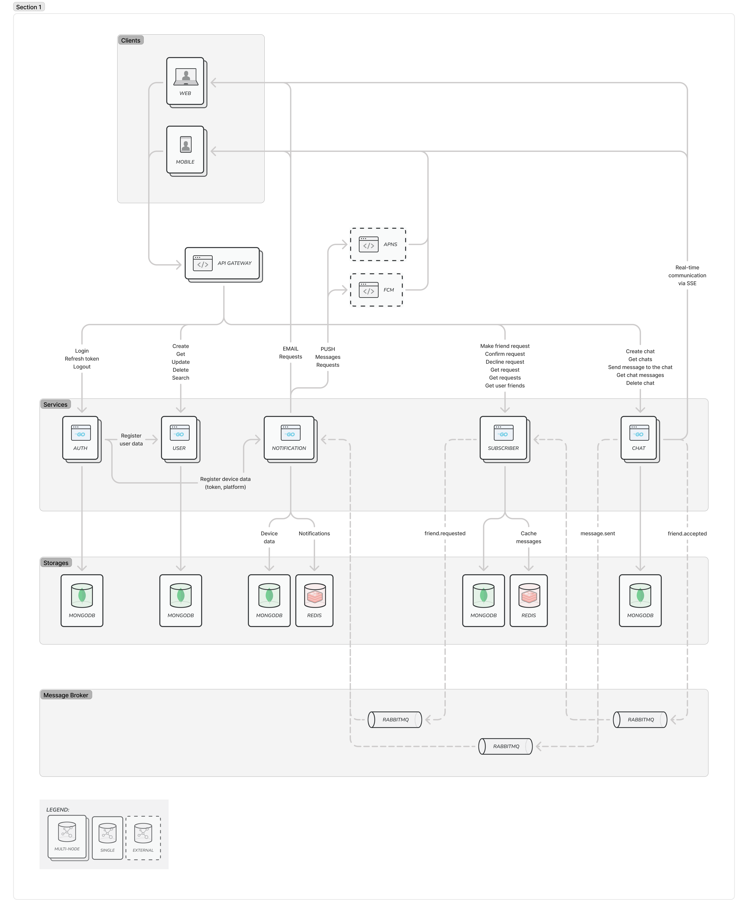

# MSA Messenger

Microservices-based messenger application.

## Architecture



### Services

1. **SSO Service** (external: `rshelekhov/grpc-sso`)

   - Unified authentication and user management via gRPC
   - JWT token generation and validation
   - User profile management and registration
   - DB: PostgreSQL
     - Efficient relational structure
     - Support for complex transactions
     - ACID compliance for critical auth operations

2. **Chat Service** (`cmd/chat`)

   - Message handling
   - Real-time communication via gRPC-Web + SSE
   - Message history
   - Chat management (create, delete, list)
   - DB: MongoDB (messages, chat history)
     - Document-based storage for flexible message schemas
     - Horizontal scaling for message history
     - Efficient querying for chat history
   - Cache: Redis
     - Pub/sub for real-time message delivery
     - Last message cache with TTL
     - Online user presence tracking
     - Message delivery status

3. **Subscriber Service** (`cmd/subscriber`)

   - Friend request management
   - Friend list management (confirmed and pending)
   - Friend status tracking
   - DB: Redis for friend lists and request status
     - Fast in-memory operations for friend lists
     - Atomic operations for friend status updates
     - Set operations for efficient friend list management
     - TTL for pending friend requests

4. **Notification Service** (`cmd/notification`)

   - Push notifications
   - Email notifications
   - Real-time event handling
   - DB: MongoDB (device tokens, notification preferences)
     - Document-based storage for device information
     - Efficient querying for user devices
     - Long-term storage for device tokens
   - Cache: Redis (notification queue and delivery status with TTL)
     - Queue implementation for notification delivery
     - Fast message processing
     - Automatic cleanup of delivered notifications
     - Pub/sub for real-time delivery

5. **API Gateway** (`cmd/gateway`)
   - Request routing
   - Rate limiting
   - No DB

### Message Broker

- RabbitMQ for async communication between services. Why RabbitMQ:
  - Reliable message delivery with acknowledgments
  - Flexible message routing (different notification types)
  - Suitable for medium loads (up to 100k messages/sec)
  - Simpler setup and maintenance compared to Kafka
  - Excellent support for message delivery confirmation
  - Enables independent service scaling
  - Supports various messaging patterns (pub/sub, point-to-point)

### Deployment

- Kubernetes for orchestration
- Blue-Green and Canary deployment strategies
- Docker for containerization

## Local Development

> **Important**: Before running any commands, ensure you're using the correct Docker context:
>
> - For MacOS: `docker context use desktop-linux`
> - For Linux: `docker context use default`
>
> All commands will work regardless of your Docker engine, but the correct context must be set first.

### Go Workspaces

This project uses Go workspaces (go.work) for local development. Benefits:

- Easy local development of shared packages
- No need to publish packages to work with dependencies
- Better IDE support for multi-module repository

The workspace is already configured, just clone and start coding.

### Commands

```
# Build all services with go
make build

# Build all services with docker
make docker-build

# Start minikube
make start

# Deploy all services to kubernetes
make deploy

# Check status
make status

# Stop minikube
make stop

# Clean up everything
make clean

# Rebuild and restart individual services
make restart-sso
make restart-chat
make restart-gateway
make restart-notification
make restart-subscriber
```

## API Documentation

[Link on Apidog will be here]
